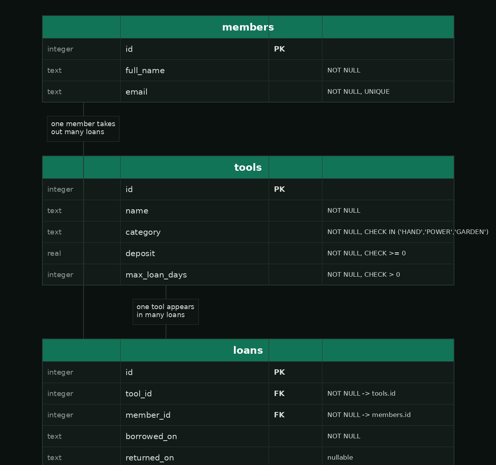

# Summative Assessment — ToolShare

## Learning Outcomes

| Learning Outcome | Section |
|---|---|
| Build Pipelines / Scripting | Section 1 |
| OOP | Section 2 |
| Brownfields | Section 3 |
| Testing | Section 4 |
| Agile Methodology | Section 5 |
| Systems Design | Section 6 |
| Relational Databases | Section 7 |
| WebDev | Section 8 |

---

## Duration

**Total time: 3 hours 50 minutes**

| Section | Recommended Time |
|---|---|
| Section 1 — Build and Release Management | 40 minutes |
| Section 2 — Practical Implementation (OOP) | 30 minutes |
| Section 3 — Working With Legacy Code | 25 minutes |
| Section 4 — Testing the Loan Service | 25 minutes |
| Section 5 — Agile Methodology | 20 minutes |
| Section 6 — Systems Design | 20 minutes |
| Section 7 — Database Schema Design | 30 minutes |
| Section 8 — Web API and Front End | 40 minutes |

---

## Scoring

| Section | Marks |
|---|---|
| Section 1 — Build and Release Management | 25 |
| Section 2 — Practical Implementation (OOP) | 15 |
| Section 3 — Working With Legacy Code | 12 |
| Section 4 — Testing the Loan Service | 13 |
| Section 5 — Agile Methodology | 10 |
| Section 6 — Systems Design | 10 |
| Section 7 — Database Schema Design | 20 |
| Section 8 — Web API and Front End | 25 |
| **Total** | **130** |

---

## Scenario

You have taken over **ToolShare**, a small service that lets community members
borrow tools — hand tools, power tools and garden tools — and returns them within
an allowed loan period. The starter project in this repository is partly built,
partly broken, and partly undocumented, which is deliberate: it reflects a real
codebase you are joining rather than one you started.

Work through the sections in order — later sections depend on earlier ones
compiling and passing. Write all short-answer responses in `answers.txt` under
the matching question heading. **Do not change the format of the file or create
a new one.**

---

# Section 1 — Build and Release Management

## Scenario

The team has adopted Maven, GitLab CI and a release script, but all three are
incomplete. Nothing beyond this section will compile or run until it is fixed.

| Task | Marks | What earns marks |
|---|---|---|
| Q1.1 — Fix the build | 6 | Correctly identifies and adds the missing dependency using its Maven Central coordinates (4), dependency declared with the correct (non-test) scope (2) |
| Q1.2 — Complete the pipeline | 9 | Correct `stages` in the correct order (2), shared Maven repository cache used by every job (2), `test` job publishes the JUnit report and keeps it on failure (3), `package` job keeps the jar as an artifact and is restricted to the default branch (2) |
| Q1.3 — Write the release script | 8 | Argument-count handling (2), version-format validation by regular expression (2), dirty-tree guard (1), tests run before packaging and a test failure aborts before packaging (1), jar copied and checksummed correctly, path printed last (2) |
| Q1.4 — Versioning a release | 2 | Correct version number and sound reason |

---

### Q1.1 — Fix the Build *(6 marks)*

This project is a small web service, but the web framework it is written
against is not declared anywhere in `pom.xml`, so nothing compiles. `Main.java`,
`ToolShareApp.java` and the test files under `src/test` show you which classes
and packages the code expects.

Find the correct dependency and add it to `pom.xml` so that `make compile`
succeeds.

> You can search for artefacts on [Maven Central](https://mvnrepository.com/repos/central).
>
> Read the compiler output carefully — it names the classes it cannot find.

---

### Q1.2 — Complete the Pipeline *(9 marks)*

`.gitlab-ci.yml` defines the image and the `compile` job as a worked example.
Read the requirements written as comments in that file, then:

- Define `stages` so the pipeline compiles, tests, then packages.
- Give every job a shared cache of the Maven local repository, so dependencies
  are downloaded once, not once per job.
- Add a `test` job that runs `make test` and publishes the Surefire XML
  reports as a JUnit report, kept even when the job fails.
- Add a `package` job that runs `make package`, keeps `target/toolshare.jar`
  as an artifact that expires after one week, and only runs on the project's
  default branch.

> You are allowed to use the [CI/CD docs](https://docs.gitlab.com/ci/yaml/).

---

### Q1.3 — Write the Release Script *(8 marks)*

`scripts/release.sh` is called by hand before every release. Its requirements
are written as comments in the file itself — implement them.

Run `./scripts/check_release.sh` once you're done; it checks the argument
handling in isolation (requirements 2 and 3) without doing a real release.
Passing it does not mean the rest of the script is correct — it only checks
argument handling.

> This task does not require any of Sections 2–8 to be complete: `make test`
> and `make package` need Section 1's own `pom.xml` fix (Q1.1) but nothing
> further.

---

### Q1.4 — Versioning a Release *(2 marks)*

`ToolShare` is currently released at version `2.1.0`. You fix a bug in the
late-fee calculation so that it now returns the correct amount in a case it
previously got wrong. No public method signature changes.

State the new version number and explain, in one or two sentences, why.

---

# Section 2 — Practical Implementation (OOP)

## Scenario

Two classes in the `Tool` hierarchy are incomplete: `PowerTool`, which does not
do its job yet, and `Member`, which does not protect its own data.

| Task | Marks | What earns marks |
|---|---|---|
| Q2.1 — Implement `PowerTool` | 8 | `category()`, `deposit()` and `maxLoanDays()` return the correct values (4), wattage is stored and returned (2), the constructor rejects a wattage that is zero or negative (2) |
| Q2.2 — Fix `Member`'s encapsulation | 7 | Fields made private (2), `email` made immutable (1), constructor validates name and email and rejects invalid input (2), `rename` validates its argument and leaves the name unchanged when it is rejected (2) |

---

### Q2.1 — Implement `PowerTool` *(8 marks)*

`PowerTool` extends `LoanItem`'s cousin `Tool` (see `Tool.java`) but every
method currently throws `UnsupportedOperationException`. Implement it so that:

- `category()` returns `"POWER"`.
- `deposit()` returns `100.00`.
- `maxLoanDays()` returns `3`.
- The constructor takes a wattage in addition to id and name, and
  `getWattage()` returns it.
- The constructor throws `IllegalArgumentException` if the wattage is zero or
  negative.

`PowerToolTest` describes the exact behaviour expected.

> You may not modify the tests.

---

### Q2.2 — Fix `Member`'s Encapsulation *(7 marks)*

`Member` currently exposes its fields as public and does not validate
anything it is given. Fix it so that:

- Every field is private.
- `email` cannot be reassigned after construction.
- The constructor rejects a `null`, empty, or blank full name, and rejects a
  `null`, empty email or one that does not contain an `@`, throwing
  `IllegalArgumentException` in each case.
- `rename(String newName)` applies the same name validation as the
  constructor, and leaves the existing name unchanged if the new name is
  rejected.

`MemberTest` describes the exact behaviour expected.

> You may not modify the tests.

---

# Section 3 — Working With Legacy Code

## Scenario

`LegacyCharges.calc(...)` was written years ago by someone who has since left
the company. It is called by the nightly billing job, which lives in another
repository you do not have access to — so **the signature of `calc(...)` must
never change**, and there is no design document describing exactly what it is
supposed to do. There are also no tests, which means nobody can currently
change this class with any confidence.

| Task | Marks | What earns marks |
|---|---|---|
| Q3.1 — Characterize `LegacyCharges` | 10 | Tests exercise every branch of `calc(...)` — all three categories, the premium-member discount, the loyalty-prior-overdues surcharge, the R100 cap, and the unrecognised-category case (8), every test passes against the code exactly as it stands (2) |
| Q3.2 — Explain your approach | 2 | Sound, concise explanation of why the tests were written this way |

---

### Q3.1 — Characterize `LegacyCharges` *(10 marks)*

Write tests in `LegacyChargesCharacterizationTest.java` that **characterize**
`calc(...)` — that is, they document exactly what it currently does, correct or
not, so that a future change to this class can be made safely. Do **not**
change `LegacyCharges.java` itself.

Read the method carefully; your tests must cover:

- Each of the three recognised categories (`"HAND"`, `"POWER"`, `"GARDEN"`),
  both when the loan is overdue and when it is not.
- The extra `POWER` surcharge that only applies once the tool is more than 5
  days past its allowed period.
- The behaviour when `prem` (premium member) is `true`.
- The behaviour when `prior` (prior overdue loans) is greater than 3.
- The R100 cap.
- What the method returns for a category it does not recognise.

Run `mvn test` — every test you write must pass.

---

### Q3.2 — Explain Your Approach *(2 marks)*

In `answers.txt`, in two or three sentences: why is it correct for these
tests to lock in the method's current behaviour even where you suspect that
behaviour is a bug (for example, the flat `+3` added to every `GARDEN` fee,
overdue or not)? What would you do differently if you were asked to actually
fix a bug in this method?

---

# Section 4 — Testing the Loan Service

## Scenario

`LoanService` decides whether a member may borrow a tool and works out how
overdue a returned loan is. It has no tests of its own, and one of its
existing test files has two failing tests.

| Task | Marks | What earns marks |
|---|---|---|
| Q4.1 — Unit test `LoanService` | 8 | Tests cover the loan limit, refusing an already-loaned tool, returning a tool, refusing a double return, and the "no such loan" case (6), a hand-written fake repository and a fixed `Clock` are used — no mocking library, no real clock (2) |
| Q4.2 — Fix the failing tests | 5 | Correctly identifies which of the two failing tests is wrong and which is right (2), fixes the one that is wrong without changing `LoanService`'s correct behaviour (2), explains the reasoning in `answers.txt` (1) |

---

### Q4.1 — Unit Test `LoanService` *(8 marks)*

`LoanServiceTest.java` is currently empty. Using an `InMemoryLoanRepository`
(or a hand-written fake of your own) and a fixed `java.time.Clock`, write
tests that cover:

- A member may not have more than `LoanService.MAX_ACTIVE_LOANS` active loans
  at once.
- A tool that is already on an active loan cannot be borrowed again.
- Returning a tool marks the loan as no longer active.
- A loan that has already been returned cannot be returned again.
- Attempting to return a loan id that does not exist fails clearly.

> No mocking library, no real clock, no real database — a fake repository and
> a fixed `Clock` are enough, and are what the marks are looking for.

---

### Q4.2 — Fix the Failing Tests *(5 marks)*

Run `mvn test`. Two tests in `LoanServiceOverdueTest` currently fail. For
**each** failing test, decide whether the **test's expectation** is wrong or
`LoanService.overdueDays(...)` itself is wrong, then fix whichever one is at
fault — without breaking the tests that currently pass.

In `answers.txt`, explain your reasoning for each of the two fixes: what did
the failing test reveal, and how did you decide which side to change?

> You may change `LoanServiceOverdueTest.java`, `LoanService.java`, or both —
> whatever the fix genuinely requires. Do not simply change an assertion to
> match whatever the code currently outputs; explain why the new expectation
> is the correct one.

---

# Section 5 — Agile Methodology

## Scenario

ToolShare's next feature, in the backlog but not yet built, is a **loan
extension**: a member asks to keep a tool for a few extra days past its
original due date, and staff can approve or decline the request.

This section is answered entirely in `answers.txt` — there is no code to
write or run.

| Task | Marks | What earns marks |
|---|---|---|
| Q5.1 — Write the user story | 4 | Story follows a recognisable "as a / I want / so that" (or equivalent) form (1), at least three acceptance criteria that are specific and testable (3) |
| Q5.2 — Responding to a scope cut | 3 | Identifies a sound approach to cutting scope without abandoning the story's value, and explains the trade-off | 
| Q5.3 — The retro | 3 | Identifies a concrete, actionable improvement (not a vague sentiment) and explains why a retro is the right place to raise it |

---

### Q5.1 — Write the User Story *(4 marks)*

Write one user story for the loan-extension feature described above, together
with at least three acceptance criteria.

---

### Q5.2 — Responding to a Scope Cut *(3 marks)*

Two days before the end of the sprint, the loan-extension story is clearly not
going to be finished in full — the "staff can decline a request" part will not
make it. The rest of the team wants to ship what's done rather than carry the
whole story into the next sprint.

Explain how you would split or adjust the story so that what ships is still a
usable increment, and what you would do with the leftover work.

---

### Q5.3 — The Retro *(3 marks)*

During this sprint, the same missing-dependency mistake from Section 1 (Q1.1)
was made by two different developers, on two different days, each losing
close to half an hour discovering the same fix independently.

What would you raise about this in the sprint retrospective, and what concrete
action would you propose come out of it? Explain briefly why a retro — rather
than, say, a code review comment — is the right place to raise it.

---

# Section 6 — Systems Design

## Scenario

This section asks you to reason about the design decisions already made
elsewhere in this codebase — and one still to come. There is no code to write
here; answer in `answers.txt`.

| Task | Marks | What earns marks |
|---|---|---|
| Q6.1 — Interfaces and testability | 4 | Correctly explains what `LoanRepository` and `ToolCatalogue` being interfaces (rather than concrete classes) buys the project, with reference to `InMemoryLoanRepository` and Section 4's tests |
| Q6.2 — Choosing HTTP status codes | 3 | Sound justification for each of the three status codes named, in terms of what each communicates to a client |
| Q6.3 — A growth scenario | 3 | Identifies a genuine bottleneck or risk in moving from one SQLite file to many concurrent users, and a reasonable direction for addressing it |

---

### Q6.1 — Interfaces and Testability *(4 marks)*

`LoanService` depends on `LoanRepository`, an interface, rather than directly
on a class that talks to a database. `InMemoryLoanRepository` is one
implementation of it.

Explain what this buys the project. Refer specifically to how Section 4's
tests (Q4.1) were able to test `LoanService` without a real database, and to
what would need to change if ToolShare later added a `SqliteLoanRepository`.

---

### Q6.2 — Choosing HTTP Status Codes *(3 marks)*

Section 8 asks you to make `POST /api/loans` return `404` when the tool does
not exist, `409` when the tool is already on loan or the member has reached
their loan limit, and `400` when the request body is malformed or missing a
field.

For each of these three status codes, explain in one sentence why it is the
right choice rather than, say, always returning `400` for any failure.

---

### Q6.3 — A Growth Scenario *(3 marks)*

ToolShare currently uses a single SQLite database file, and Section 7 has you
design its schema. Suppose the tool library is adopted by ten branches across
the city, all needing to see the same live catalogue and loan records at the
same time.

Identify the main problem this creates for the current design, and describe,
at a high level, one reasonable way you would address it. (You do not need to
implement anything — a few sentences of reasoning is enough.)

---

# Section 7 — Database Schema Design

## Scenario

`ToolShare` currently keeps everything in memory. The next step is to persist
`members`, `tools` and `loans` in a real database. `resources/erd.png` is the
entity relationship diagram for the three tables you need to create:



A `Database` class is already provided and knows how to open a JDBC
connection to a SQLite database. `DatabaseSchema.createSchema(Connection
connection)` is where the schema itself is created, but the method body is
currently empty. `Queries` is where three read queries used elsewhere in the
application belong — each is currently an empty string.

> `resources/SQL-Cheat-Sheet.pdf` is provided as a reference if you need a
> refresher on SQL syntax (data types, constraints, `CREATE TABLE`, joins,
> aggregates, etc.).

| Task | Marks | What earns marks |
|---|---|---|
| Q7.1 — Create the `members` table | 3 | Correct columns and types, `id` as primary key, `full_name` and `email` `NOT NULL`, `email` `UNIQUE` |
| Q7.2 — Create the `tools` table | 4 | Correct columns and types, `id` as primary key, all four remaining columns `NOT NULL`, `category` constrained to `'HAND'`, `'POWER'` or `'GARDEN'`, `deposit` constrained to be non-negative, `max_loan_days` constrained to be positive |
| Q7.3 — Create the `loans` table | 5 | Correct columns and types, `id` as primary key, `tool_id`, `member_id` and `borrowed_on` `NOT NULL` and `returned_on` nullable, both foreign keys correctly declared |
| Q7.4 — `ACTIVE_LOANS` query | 3 | Correct columns, correct join, only unreturned loans, correctly ordered |
| Q7.5 — `BUSY_MEMBERS` query | 3 | Correct grouping and count, correct threshold, correctly ordered |
| Q7.6 — `NEVER_BORROWED` query | 2 | Correctly finds tools with no matching loan row, correctly ordered |

---

### Q7.1 – Q7.3 — Create the Schema *(12 marks)*

Implement `DatabaseSchema.createSchema(Connection connection)` so that it
creates the `members`, `tools` and `loans` tables exactly as shown in the ERD,
using standard SQL `CREATE TABLE` statements executed through the JDBC
`Connection` you are given.

> Create `members` and `tools` before `loans` — `loans` references both.
>
> This task is schema creation only — you are not inserting or querying any
> data yet. Run `mvn test` to check your schema against
> `DatabaseSchemaTest`.

---

### Q7.4 – Q7.6 — Write the Queries *(8 marks)*

Implement the three constants in `Queries.java` as SQL `SELECT` statements.
`QueriesTest` seeds sample data and checks each query's output exactly, so
column aliases matter.

- **`ACTIVE_LOANS`** — one row per loan that has not yet been returned,
  giving the member's `full_name`, the tool's name aliased as `tool_name`,
  and `borrowed_on`, ordered from the oldest `borrowed_on` to the most
  recent.
- **`BUSY_MEMBERS`** — one row per member who has taken out **two or more**
  loans in total (returned or not), giving `full_name` and a count aliased
  as `loan_count`, ordered from the most loans to the fewest.
- **`NEVER_BORROWED`** — the name (aliased as `tool_name`) of every tool that
  has never appeared in a single loan, in alphabetical order.

> Run `mvn test` to check your queries against `QueriesTest`. This task
> depends on Q7.1–Q7.3 being correct first.

---

# Section 8 — Web API and Front End

## Scenario

`ToolShareApp` wires up a small web server. The framework is now available
(Q1.1), `/health` is provided as a worked example, and `src/main/resources/public/index.html`
is served automatically at `/` — but it doesn't call the API yet, and neither
`GET /api/tools`, `GET /api/tools/{id}` nor `POST /api/loans` exist.

| Task | Marks | What earns marks |
|---|---|---|
| Q8.1 — `GET /api/tools` | 6 | Returns every tool as a JSON array (4), correct `Content-Type` and field names matching `ToolResponse` (2) |
| Q8.2 — `GET /api/tools/{id}` | 6 | Returns the matching tool as JSON (2), returns `404` with a JSON error body for an unknown id (2), returns `400` with a JSON error body for a non-numeric id (2) |
| Q8.3 — `POST /api/loans` | 9 | Creates the loan and returns `201` with the created loan as JSON (3), returns `409` when the tool is already on loan or the member is at their loan limit (2), returns `400` for a missing field or malformed JSON (2), returns `404` for an unknown tool id (2) |
| Q8.4 — Wire up the front end | 4 | Page fetches the tools endpoint and renders each tool into `#tool-list` (3), a failed request shows a message in `#status` instead of leaving the page blank (1) |

---

### Q8.1 — `GET /api/tools` *(6 marks)*

Add a route that returns every tool in the `ToolCatalogue` as a JSON array,
using the `ToolResponse` record already provided to shape each element.

---

### Q8.2 — `GET /api/tools/{id}` *(6 marks)*

Add a route that returns the single matching tool as JSON. If no tool has
that id, respond `404` with an `ErrorResponse` body. If the `{id}` path
segment is not a valid number, respond `400` with an `ErrorResponse` body.

---

### Q8.3 — `POST /api/loans` *(9 marks)*

Add a route that reads a `LoanRequest` from the JSON request body and asks
`LoanService` to create the loan, responding `201` with a `LoanResponse` body
on success.

Use `LoanService` and `ToolCatalogue` (already wired into `ToolShareApp`) to
turn failures into the right status code, each with an `ErrorResponse` body:

- `400` — the request body is missing `memberId` or `toolId`, or is not
  valid JSON at all.
- `404` — `toolId` does not match any tool in the catalogue.
- `409` — `LoanService` refuses the loan (tool already on loan, or the
  member is at their loan limit).

`ToolShareApiTest` describes the exact behaviour expected for all of Q8.1–Q8.3.

> You may not modify the tests.

---

### Q8.4 — Wire Up the Front End *(4 marks)*

`src/main/resources/public/index.html` is served automatically at `/` once
`ToolShareApp.create()` runs (see the `staticFiles` configuration already
present). Complete the inline `<script>` so that it calls the tools endpoint
you built in Q8.1 and renders each tool into the `#tool-list` list — one item
per tool, showing at least its name, category, deposit and max loan days. If
the request fails, show a short message in `#status` instead of leaving the
page blank.

Run `make package` and `java -jar target/toolshare.jar`, then open
`http://localhost:7070/` in a browser to check it against a running server.

---

### End of Assessment

---

## Project structure

```
toolshare/
  README.md
  answers.txt
  pom.xml
  Makefile
  .gitlab-ci.yml
  scripts/
    release.sh
    check_release.sh
  resources/
    erd.png
    SQL-Cheat-Sheet.pdf
  src/
    main/java/za/co/wethinkcode/toolshare/
      Tool.java
      HandTool.java
      GardenTool.java
      PowerTool.java
      Member.java
      Loan.java
      LoanRefusedException.java
      LoanRepository.java
      InMemoryLoanRepository.java
      LoanService.java
      ToolCatalogue.java
      InMemoryToolCatalogue.java
      ToolResponse.java
      LoanRequest.java
      LoanResponse.java
      ErrorResponse.java
      ToolShareApp.java
      Main.java
      Database.java
      DatabaseSchema.java
      Queries.java
      LegacyCharges.java
    main/resources/public/
      index.html
    test/java/za/co/wethinkcode/toolshare/
      ToolTest.java
      PowerToolTest.java
      MemberTest.java
      LegacyChargesCharacterizationTest.java
      LoanServiceTest.java
      LoanServiceOverdueTest.java
      DatabaseSchemaTest.java
      QueriesTest.java
      ToolShareApiTest.java
      StaticPageTest.java
```

## Useful commands

```bash
# Compile the source code
mvn compile

# Resolve and download every declared dependency
mvn dependency:resolve

# Run the test suite
mvn test

# Package the application into a runnable jar
mvn package -DskipTests

# Run the packaged jar
java -jar target/toolshare.jar

# Cut a release (Q1.3)
./scripts/release.sh 1.2.3
```

The `Makefile` wraps the same commands, and is what the GitLab CI pipeline
runs:

```bash
make compile
make test
make package
```

Sections can mostly be completed in order — `make package` does not run the
test suite, so later `mvn test` runs will only be as complete as the sections
you've finished. Once every section is complete, a plain `mvn package` will
also succeed and `java -jar target/toolshare.jar` will serve a working page
at `http://localhost:7070/`.
